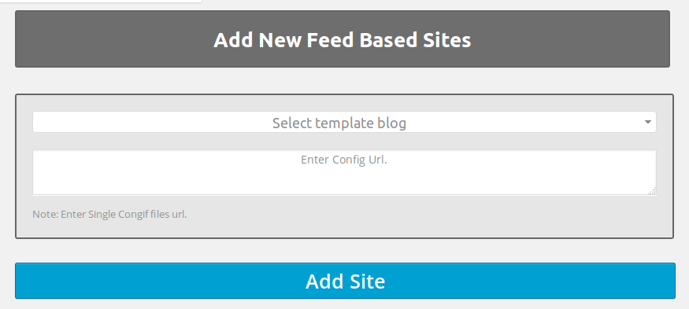

# Wordpress Custom Plugins

This repo contains the all the custom worpdress plugins.

#Following the details about the Plugins.

## Plugin Name: [AW Blogger](https://github.com/dev-artworld/plugins/tree/master/aw-blogger)
Plugin allow admin to create a new site using the XML configuration file and Template blog.
plugin setup a new wordpress blog on the server using the different parameters that are defined in the XML file.
plugin replicates all the setting from the template blog which is selected when creating the blog.

  

