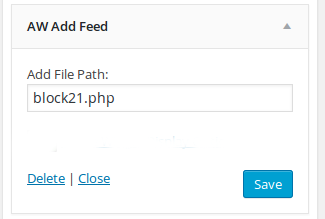

#AW AddFeed

## Plugin Name: [AW AddFeed](https://github.com/dev-artworld/plugins/tree/master/aw-addfeed)
Plugin allow you to include external files in the [Wordpress](https://wordpress.org) blog through widgets.
User can include any file in the [Wordpress](https://wordpress.org) page. This plugin is mainly used to include the advertisement code in the blog.

 
### Blog Widget page.
 

  

 
### Aw AddFeed widget setting.
 

  

