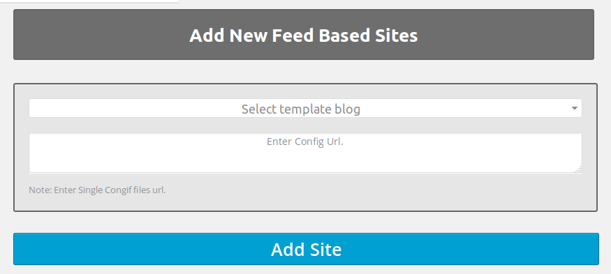
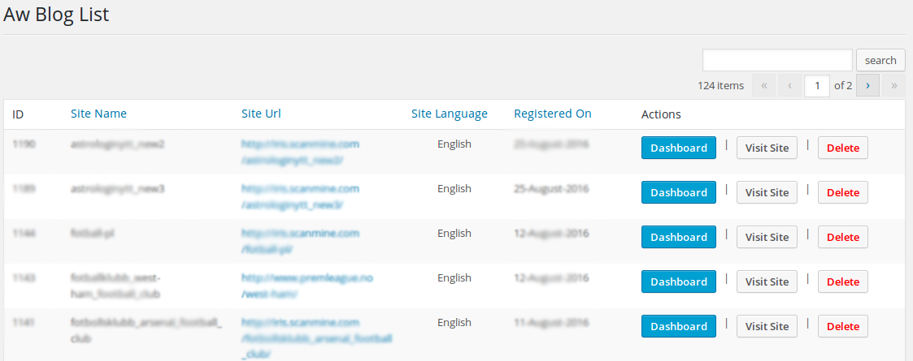

#Aw Blogger

## Plugin Name: [AW Blogger](https://github.com/dev-artworld/plugins/tree/master/aw-blogger)
Plugin allow admin to create a new site using the XML configuration file and Template blog.
plugin setup a new wordpress blog on the server using the different parameters that are defined in the XML file.
plugin replicates all the setting from the template blog which is selected when creating the blog.

###Features
* Create Blog using XML configuration file.
* List of all the blog created.
* Visit any blog directly form list.
* Go directly to any blog's dashboard form list.
* Delete blogs.
* Function to test if XML config file is valid.

<br />
### Add New Blog Interface
<br />

<p align="center">
  
</p>

<br />

### List of all blogs.
<br />

<p align="center">
  
</p>

<br />

### Sample XML configuration file structure.
```
<site>
	<address>[PathToCreateBlog]</address>
	<title>[BlogTitle]</title>
	<description>[Description]</description>
	<owner>[AdminEmail]</owner>
	<theme>[Theme]</theme>
	<feeds>
		<feed>
			[XmlFeedUrl]
		</feed>
	</feeds>
	<options>
		<option>
			[CustomOptions]
		</option>
	</options>
	<pages>
		<page>
			[Pages]
		</page>
	</pages>
</site>
```
