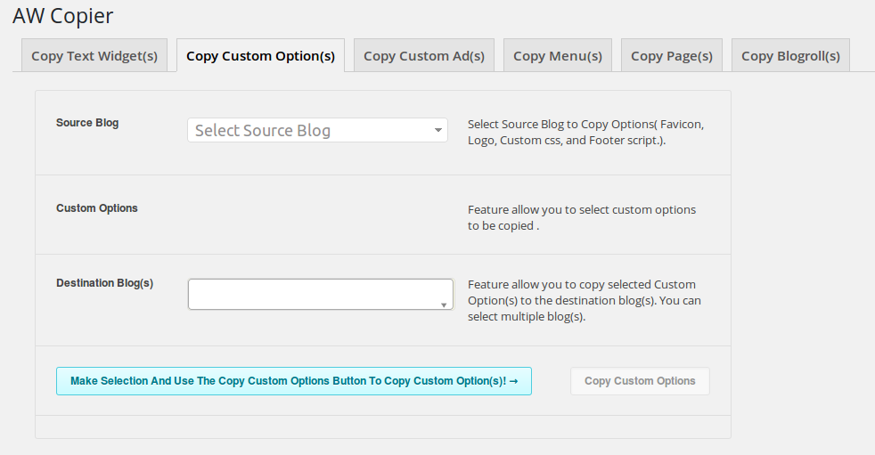

#AW Copier

## Plugin Name: [AW Copier](https://github.com/dev-artworld/plugins/tree/master/aw-copier)
Plugin allow admin to copy content and setting among different blogs.

## Admin can copy following options:
* Copy Widget.
* Copy Blogroll.
* copy custom advertisement.
* copy custom options.
* copy pages.
* Copy Menus.

 
### Copy Widget.
Copy the widgets from the selected blog to the destination blog.
 

 
### Copy Blogroll.
Copy the Blogroll from the selected blog to the destination blog.
 

 
### copy custom advertisement
Copy the custom advertisement from the selected blog to the destination blog.
 

 
### copy custom options
Copy the copy custom options from the selected blog to the destination blog.
 

 
### copy pages
Copy pages from the selected blog to the destination blog.
 

 
### Copy Menus
Copy Menus from the selected blog to the destination blog.
 

